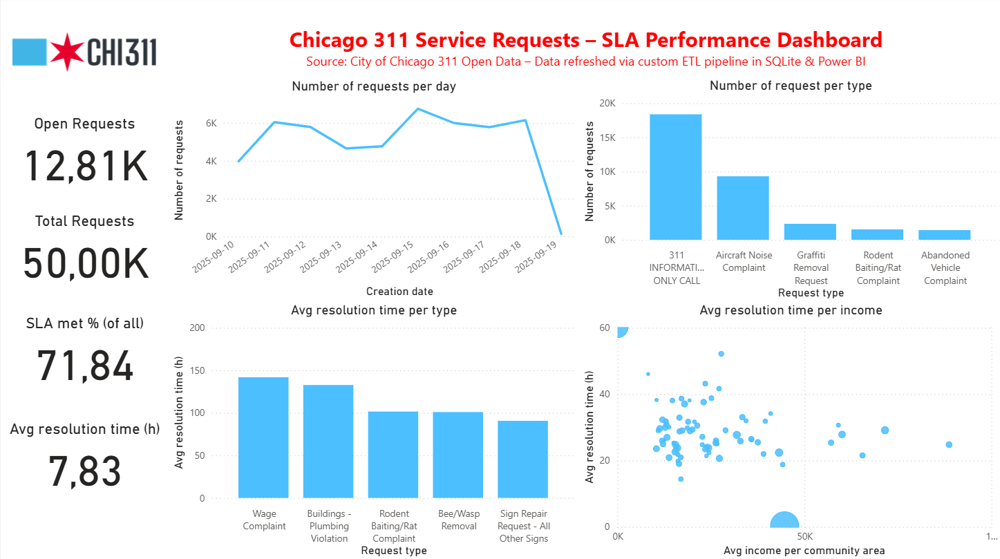
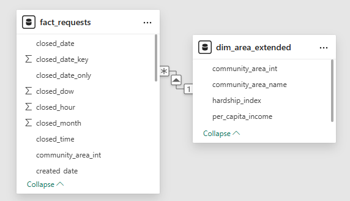
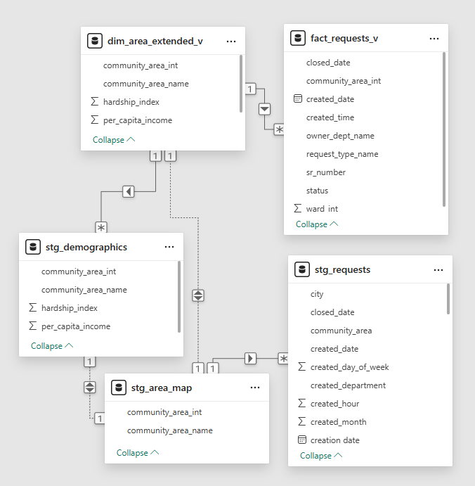

# Chicago 311 Service Requests – ETL vs. ELT Pipeline

## Project Overview
This project demonstrates the design and implementation of **data pipelines** using both **ETL (Extract–Transform–Load)** and **ELT (Extract–Load–Transform)** approaches.  
The focus is on end-to-end data processing, database modeling, automation, and business intelligence integration.

Data sources:
- **Chicago 311 Service Requests** via the City of Chicago Open Data API
- **Demographic and Community Mapping Data** from local CSV files (ACS data + boundaries)

Target system:
- **SQLite Warehouse**, connected to **Power BI** for reporting and visualization.

---

## Pipeline Architecture
### ETL
- Transformations performed in **Python** (Pandas).
- Aggregated fact/dimension tables loaded into SQLite.

### ELT
- Raw data **staged** into SQLite without transformations.
- KPIs and calculations implemented via **SQL views** inside the database.

 Both pipelines load into separate databases (`warehouse_etl.db` and `warehouse_elt.db`) to allow side-by-side comparison.

---

## Steps
1. **Extraction**
   - 311 service requests via **API (Socrata endpoint)**
   - Demographics + community mapping via **local CSV**
2. **Transformation**
   - **ETL:** Resolution time, SLA compliance, date/time splits in Python.
   - **ELT:** Raw staging in SQLite; resolution time & SLA computed in SQL views.
3. **Load**
   - Data stored in **SQLite fact/dim tables** (ETL).
   - Data stored in **staging + views** (ELT).
4. **Reporting**
   - Power BI connected directly to SQLite databases.
   - Interactive dashboards for SLA compliance, open requests, request types, and demographic context.
5. **Automation**
   - PowerShell script executes pipelines (ETL + ELT) every X minutes.
   - Logs are written to `logs/pipeline_runs.log`.
  
---

## Architecture diagram
  
### ETL Flow

API (311 Service Requests)

Local CSV (Demographics & Mapping)

↓

Python Transformations (resolution time, SLA, date splits)

↓

SQLite Database (fact_requests, dim_area_extended)

↓

Power BI Report

### ELT Flow

API (311 Service Requests)

Local CSV (Demographics & Mapping)

↓

SQLite Staging Tables

↓

SQL Views (fact_requests_v, dim_area_extended_v)

↓

Power BI Report

---

## 📑 ETL vs. ELT – Key Takeaways
- **ETL:**  
  ✅ Clear, pre-aggregated tables  
  ✅ Easier to consume for BI tools  
  ❌ Less flexible if requirements change  

- **ELT:**  
  ✅ Raw history preserved in staging  
  ✅ Pushes heavy transformations to SQL/database layer  
  ✅ Easier to change transformations without rerunning full pipeline  
  ❌ Requires stronger SQL skills and DB optimization  

---

## Power BI Dashboard
Key insights:
- SLA compliance
- Average resolution time
- tickets trend
- analysis with demographics (per capita income, hardship index)

Dashboard and Schema ETL:

Dashboard and Schema ELT:

---

## Repository Structure

├── pipeline_etl.py # ETL pipeline

├── pipeline_elt.py # ELT pipeline

├── run_pipelines_template.ps1 # Automation script (PowerShell)

├── data/

│ └── raw/ # ACS + mapping CSVs (public data)

├── log/ # Run log

├── README.md # Project documentation

└── screenshots/ # Power BI dashboard & schema screenshots

---

## How to Run

This project includes a PowerShell script (run_pipeline_template.ps1) that demonstrates how to schedule and run the pipeline automatically.
Users should adapt paths for their environment and optionally configure Windows Task Scheduler to run at fixed intervals.

1. Clone the repo (bash) 

   git clone https://github.com/<your-username>/chicago-311-pipeline.git
   
   cd chicago-311-pipeline

2. Create and activate Conda environment (bash)

   conda create -n ticketpipeline python=3.12
   
   conda activate ticketpipeline
   
   pip install -r requirements.txt

3. Run ETL pipeline (bash)

   python pipeline_etl.py

4. Run ELT pipeline (bash)

   python pipeline_elt.py

5. Open Power BI → connect to warehouse_etl.db or warehouse_elt.db

6. Optional: Automate via PowerShell (powershell)

     .\run_pipelines_template.ps1

---

## Learnings

Built end-to-end pipelines in two approaches (ETL & ELT)

Integrated API + local data sources

Applied data modeling (fact/dim vs. staging/views)

Connected pipelines to Power BI for interactive insights

Automated refresh runs with PowerShell scripting
   

